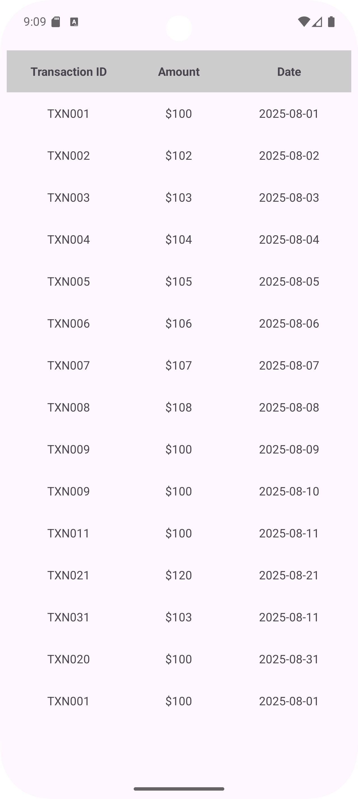

# SecureSwipe Fraud Detection Dashboards

# Real-Time Online Payment Fraud Detection and Blocking System

## Problem Statement

Online payment fraud is rapidly increasing worldwide across multiple channels such as cards, net banking, UPI, and tap-to-pay. Fraudsters use sophisticated tactics including social engineering, phishing, device takeovers, and merchant manipulation to bypass existing prevention systems.

Current fraud detection solutions often fail to provide real-time protection and lack adaptive intelligence, which results in delayed or missed detections and significant financial losses.

*Key Challenge:*  
How can we build a system that instantly detects and blocks fraudulent behavior before damage occurs?

---

## Solution Overview

We propose a real-time, intelligent fraud detection system with the following capabilities:

- *Instant Transaction Analysis:* Every transaction is analyzed in real-time.
- *Machine Learning-Based Risk Scoring:* Uses behavioral patterns, location anomalies, transaction types, and volume spikes.
- *Dynamic Flag & Verify Process:* Flags suspicious transactions for immediate user verification.
- *Automated Blocking:* Prevents transactions that fail verification or exceed risk thresholds.
- *Continuous Learning:* System adapts to emerging fraud patterns through feedback loop and retraining.
- *Multi-Channel Coverage:* Supports payments via cards, net banking, UPI, and tap-to-pay.

---

## Features

- Real-time monitoring of online transactions.
- Risk scoring based on multiple transaction attributes.
- Immediate user challenge for flagged transactions.
- Audit trails and reporting for compliance and analysis.
- Dashboard integration for analysts and stakeholders.

---

## Sample Code Snippet: Transaction Risk Scoring (Python)

# SecurePay Fraud Detection App

## What Our App Does – SecurePay

SecurePay is an app built to *drastically cut online fraud risk*.

Scenario: User logs in and tries to make a payment.

Transaction is routed to a secure *FTC-based backend system* for analysis by:
- Data analysts
- FTC officers
- Cybersecurity experts

---

## How Our AI Detects Fraud – Smart Transaction Check

Each transaction goes through our *machine learning model* that scans for:

1. *Unusual Payment Behavior*

2. *Drastic Shift in User Location*

3. *Sudden Rise in Payments to Risky Merchants*  
   (e.g., gambling, crypto)

4. *Spike in Transaction Volume*  
   in short time

Flags are raised automatically before fraud can occur.

---

## Flag & Verify – Stop Hackers in Real-Time

- *Flagged Transactions:* Trigger instant user verification.

- *If Not Verified:* The transaction is blocked.

- *Hacker Stopped:* Potential hacker is stopped.

This process creates a dynamic firewall around each transaction.

---

## Dashboard 1 (Blue): Current Fraud Scenario

**Overview:**

This dashboard provides a snapshot of the present landscape of payment fraud across multiple channels including UPI, net banking, credit, and debit cards.

**Key Highlights:**

- High volumes of fraud incidents and anomalies detected.
- Identification of vulnerable payment methods and cities most affected by fraud.
- Year-on-year statistics and trends for quick insight into evolving fraud patterns.
- Heatmaps and charts to pinpoint fraud hotspots and common fraud types.

**Purpose:**

To present a clear and comprehensive view of existing fraud challenges before the implementation of SecureSwipe's Machine Learning model.

---

## Dashboard 2 (Red): Projected ML-Enhanced Scenario

**Overview:**

This dashboard projects the anticipated improvements after deploying SecureSwipe’s AI-powered fraud detection model.

**Key Highlights:**

- Significant reduction in fraud cases through adaptive machine learning.
- Trendlines illustrating enhanced fraud detection as the model learns continuously.
- Visual representation of declining fraud totals and fewer flagged transactions in major cities.
- Pie and bar charts showcasing safer transaction methods and improved detection rates.

**Purpose:**

To demonstrate the positive impact and growing efficiency of SecureSwipe’s ML model over time.

---

## Summary

These dashboards together provide stakeholders with:

- A clear understanding of current fraud risks.
- Data-driven projections on the effectiveness of AI-enhanced fraud detection.
- Visual tools to track progress and identify ongoing risks.

---

*SecureSwipe - Empowering secure payments with AI-driven fraud prevention.*

## Screenshots

**Dashboard 1**

**Dashboard 2**

**App Screenshots**

**Website Screenshots**

